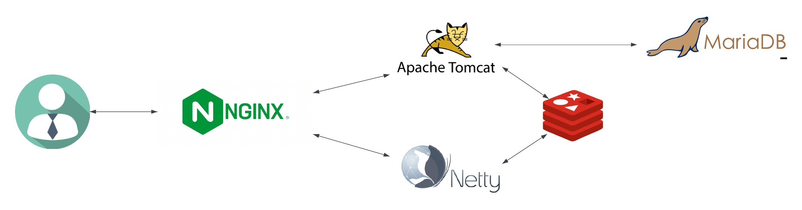

## 🛠️ 프로젝트 정보

- **프로젝트명:** 메랜인
- **설명:** 메이플랜드(RPG 게임) 에서 파티 구인/구직을 위한 채팅 사이트 
- **페이지 URL:** [https://mapleland.in](https://mapleland.in) (카카오 로그인 하시면 확인 가능합니다)
- **진행 상황:** 개발 중

## 🌟 주요 기능

- **인증:**
  - 카카오 로그인 (OAuth2)
  - JWT 토큰 기반 인증( + 구글 추가 예정)
- **채팅 시스템:**
  - Redis Pub/Sub
  - WebSocket
  - Netty를 활용한 실시간 통신

## 🔧 기술 스택

- **프레임워크:**
  - Spring Boot
  - React
- **ORM:**
  - JPA (Redis 캐싱 사용)
- **데이터베이스:**
  - MariaDB
  - Redis
- **리버스 프록시:**
  - Nginx
- **컨테이너:**
  - Docker

## 🖥️ 시스템 아키텍처

